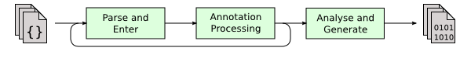

## Reflection
### 硬编码VS软编码
硬编码：固定死的写法
Soucecode(.java) -> complile -> 字节码(.class) -> 运行

不修改源码的情况下发生变换——>软编码——>反射机制

### 反射Reflction的介绍
反射机制使得程序能够在运行时反观和修改内部结构，反射允许程序在**运行时动态地操作类和对象**
包括创建对象、访问字段和调用方法等等，但对于构建灵活的运用和复杂的框架非常重要
### 为什么要引入反射

这种访问清晰直观，但在有些场景中需要在运行时动态的操作成员，例如根据数据库中提供的类名或方法名或者基于字符串变量来动态实例化对象或调用方法时。，这种方式就不在适用了。

### 什么是CLass对象

获取Class对象
类字面常量<类名.class>
```JAVA
public class ClassTest {
    public static void main(String[] args) throws ClassNotFoundException, NoSuchFieldException {
        //编译时就确定了具体的类，属于静态引用,存放User类的元数据，不会立即触发类的初始化；访问静态成员或创建实例才会触发
        Class<User> userClass = User.class;

        //运行时从User实例获取，具体类型在运行时创建和确认，在编译阶段无法判断class对象的确切类型
        User user = new User("Ye",22);
        Class<?> clazz = user.getClass(); //调用getclass方法类获取Class对象

        //forName静态方法，在运行时加载指定的类，并返回该类的Class对象实例，通常用于类名在编译时不可知的场景；立即触发类的初始化
        Class<?> clazz1 = Class.forName("com.ye.reflection.ClassTest");//字符串参数，表示代加载类的完全限定名Fully qualified name
    }
}
```
### 如何操作类？
```JAVA
public class ClassTest {
    public static void main(String[] args) throws ClassNotFoundException, NoSuchFieldException { 
        //当前字段
        Field[] fields = clazz.getDeclaredFields();//获取当前类的所有字段，无视访问权限
        for (Field field : fields) {
            System.out.println(field.getName()); //返回字段名称
        }

        //父类及当前公共字段
        Field[] publicFields = clazz.getFields();//获取Public字段
        for (Field field : publicFields) {
            System.out.println(field.getName());
        }
        
        //获取单个字段
        Field name = clazz.getDeclaredField("name");
        System.out.println(name.getType());//字段类型
        System.out.println(name.getDeclaredAnnotation(MyAnnotation.class));//字段类型,（没有注解的字段null）
        Field comment = clazz.getDeclaredField("comments"); //comments是一个泛型 
        System.out.println(comment.getGenericType());//获取完整信息

        //通过反射获取字段的过程实在运行时动态执行的，所以无法在编译阶段进行错误检测和捕获，错误只在程序执行时被发现和处理
        Field comment1 = clazz.getDeclaredField("comment22s");//字段不存在，编译不报错，而是NoSuchFieldException
    }
}
```
类层面的操作
```JAVA
File publicField = clazz.getDeclaredField("publicStaticField")
System.out.println(publicField.get(null));//类的字段，不需要类的实例
//私有字段
File privatefield = clazz.getDeclaredField("privateStaticField")
private.setAccessible(true);//设置访问权限
System.out.println(privatefield.get(null));//类的字段，不需要类的实例
//修改字段
field.set(null,20)

//方法
Method[] methods = clazz.getDeclaredMethods();
for(Method method : methods){
    System.out.println(method.getName());
}

Method method = clazz.getDeclaredMethod("myPublicStaticMethod");
method.invoke(null);//调用方法

Method method = clazz.getDeclaredMethod(
    "myPublicStaticMethod",
    String.class
);
method.invoke(null,"Hi There");//调用方法
```
### 如何操作对象？
使用反射来创建类的实例，并对实例的字段值和方法进行访问和操作。在反射中，通过类的构造器来创建实例，简单来说先从目标类的Class对象中选择一个合适的构造器，然后通过调用他的newInstance方法来创建对象。
newIstance创建的对象是在运行时动态生成的，无法在编译阶段确切知道创建对象的类型，使用Object类型来接收


反射直接调用和操作对象的方法和字段
原因：在编写阶段明确转换类型，直接显示地调用更合适，而不必依赖于反射
反射真正的价值在于**处理编译时未知的类型，从而编写更具有通用性的代码**
## Annotation
### MetaData&Annotation
元数据(MetaData)用来描述数据的数据，在 Java 里，注解是一种元数据机制：它本身并不会改变程序的运行逻辑，而是为类、方法、字段等元素附加额外的说明信息。编译器、工具链和运行时框架会通过这些元数据来决定如何处理代码
### Built-in Annotations & Meta-Annotations
#### Built-in Annotations 
JDK预设了以下注解，作用于代码：
- @Override- 检查（仅仅是检查，不保留到运行时）该方法是否是重写方法。如果发现其父类，或者是引用的接口中并没有该方法时，会报编译错误。
- @Deprecated- 标记过时方法。如果使用该方法，会报编译警告。
- @SuppressWarnings- 指示编译器去忽略注解中声明的警告（仅仅编译器阶段，不保留到运行时）
- @FunctionalInterface- Java 8 开始支持，标识一个匿名函数或函数式接口。
- @SafeVarargs- Java 7 开始支持，忽略任何使用参数为泛型变量的方法或构造函数调用产生的警告
- @Native 
#### Meta-Annotations
元注解是作用于注解上的注解，用于我们编写自定义的注解：

- @Retention- 标识这个注解怎么保存，是只在代码中，还是编入class文件中，或者是在运行时可以通过反射访问。
- @Documented- 标记这些注解是否包含在用户文档中。
- @Target- 标记这个注解应该是哪种 Java 成员。
- @Inherited- 标记这个注解是继承于哪个注解类(默认 注解并没有继承于任何子类)
- @Repeatable- Java 8 开始支持，标识某注解可以在同一个声明上使用多次。
### ElementType & RetentionPolicy
#### ElementType
定义：注解的作用目标类型，决定了注解可以应用到程序的哪些元素上
- @Target(ElementType.?)
```JAVA
public enum ElementType {
    //类、接口（包括注解接口）、枚举或记录声明
    TYPE,
    //字段声明（包括枚举常量）
    FIELD,
    //方法声明
    METHOD,
    //方法或构造函数的形式参数声明
    PARAMETER,
    //构造函数声明
    CONSTRUCTOR,
    //局部变量声明
    LOCAL_VARIABLE,
    //注解接口声明（原称注解类型）
    ANNOTATION_TYPE,
    //包声明
    PACKAGE,
    //泛型类型参数声明（JDK 8+）
    TYPE_PARAMETER,
    //类型使用位置，例如泛型、类型转换、implements 等（JDK 8+）
    TYPE_USE,
    //模块声明（JDK 9+）
    MODULE,
    //记录类的组件（record 成员）（JDK 16+）
    RECORD_COMPONENT
}
```
#### RetentionPolicy
定义：注解的生命周期决定了注解在程序中的保留策略
- @Retention(RetentionPolicy.?)
```JAVA
public enum RetentionPolicy {
    //保留在源文件中，编译时丢弃 示例@Override
    SOURCE,
    //(默认) 编译进.class文件，加载CLass文件到内存时，JVM丢掉注解 示例@Generated 
    CLASS,
    //保留到运行时存在内存中 可通过反射读取（框架）
    RUNTIME
}
```
### Lombok 

以往编写项目时，在进行类内部成员字段封装时，需要编写大量的get/set方法，不仅使得类定义中充满了get/set方法，同时如果字段名发生改变，又要挨个修改；字段多时，构造方法的编写会非常麻烦。
Lombok就是专门用于简化Java中的样板代码，通过注解的方式，能够自动生成常见的代码，比如构造函数、getter 和 setter 方法、toString 方法、equals 和 hashCode 方法等，从而使开发者能够专注于业务逻辑，而不必重复编写冗长的代码。
#### CodeExample
```JAVA
Student.java
@Getter
@Setter
@NoArgsConstructor
public class Student {
    private Integer sid;
    private String name;
    private String sex;
}
```
```JAVA
Student.class
public class Student {
    private Integer sid;
    private String name;
    private String sex;

    @Generated
    public Integer getSid() {
        return this.sid;
    }

    @Generated
    public void setSid(Integer sid) {
        this.sid = sid;
    }

    /*省略一些get/set方法*/

    @Generated
    public Student() {
        super();
    }
}
```
#### How Lombok Works
Lombok是如何做到一个注解就包揽了代码生成工作的呢？这里又要说到我们Java的编译过程，它可以分成三个阶段：

1. 所有源文件会被解析成语法树。
2. 调用注解处理器。如果注解处理器产生了新的源文件，新文件也要进行编译。
3. 最后，语法树会被分析并转化成类文件

Lombok会在上述的第二阶段，执行*lombok.core.AnnotationProcessor*，它所做的工作就是我们上面所说的，修改语法树，并将注解对应需要生成的内容全部添加到类文件中，这样，我们即使没有在源代码中编写的内容，也会存在于生成出来的class文件中。
## Example And Application
### Get a Field’s Annotations Using Reflection
```JAVA
// Code{}
``` 
### Mybatis接口绑定查询
当查询参数不止一个时
```XML
UserMapper.xml
<mapper namespace="com.ye.mapper.UserMapper">
    <select id="selectUserByIdAndAge" resultType="User">
        select * from user where id = #{id} And age = #{age}
    </select>
</mapper>
```
```JAVA
Param.class
@Retention(RetentionPolicy.RUNTIME) //注解在运行时依然存在
@Target({ElementType.PARAMETER}) //作用于方法参数
public @interface Param {
    String value();
}
```
```JAVA
User.java 
@Data 
public class User {
     int id;
     String name;
     int age;
        @Generated
    public String toString() {
        int var10000 = this.getId();
        return "User(id=" + var10000 + ", name=" + this.getName() + ", age=" + this.getAge() + ")";
    }}

}

UserMapper.java
import org.apache.ibatis.annotations.Param; //属于Mybatis的注解

public interface UserMapper {
// User selectUserByIdAndAge(int id,int age); //BindingException、wrapException

//手动添加@Param注解来指定某个参数的名
    User selectUserByIdAndAge(@Param("id") int id, @Param("age") int age);
}

UserMapper.class
public interface UserMapper {
    User selectUserByIdAndAge(int var1, int var2); //Java代码编译后形参名称无法保留，导致Mybatis无法确定具体那个参数叫什么名字
}

//加入@Param
UserMapper.class
public interface UserMapper{
    User selectUserByIdAndAge(@Param("id") int var1, @Param("age") int var2);
}
```
```JAVA
MybatisUtils.java
public class MybatisUtils {
    private static SqlSessionFactory factory;
    static {
        try{
           factory = new SqlSessionFactoryBuilder().build(new FileInputStream("HelloMybatis/src/main/resources/mybatis-config.xml"));
        }catch (FileNotFoundException e){
            e.printStackTrace();
        }
    }

    public static SqlSession openSession(boolean autoCommit){
        return factory.openSession(autoCommit);
    }
}

SqlInterface.java
public class SqlInterface {
    public static void main(String[] args) {
        try (SqlSession session = MybatisUtils.openSession(true)) {
            UserMapper mapper = session.getMapper(UserMapper.class);
            System.out.println(mapper.selectUserByIdAndAge(1,22));//传入两个参数
        }
    }
}
```
## Q&A
框架的底层实现：像 Spring、MyBatis、JUnit 都大量用反射去创建对象、注入依赖、调用方法，不需要你手动去 new